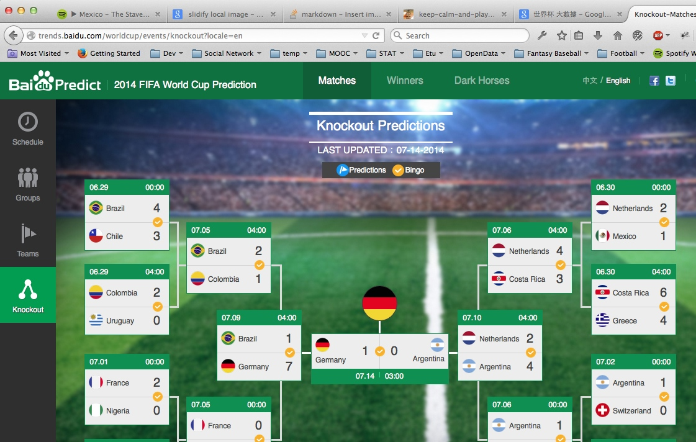
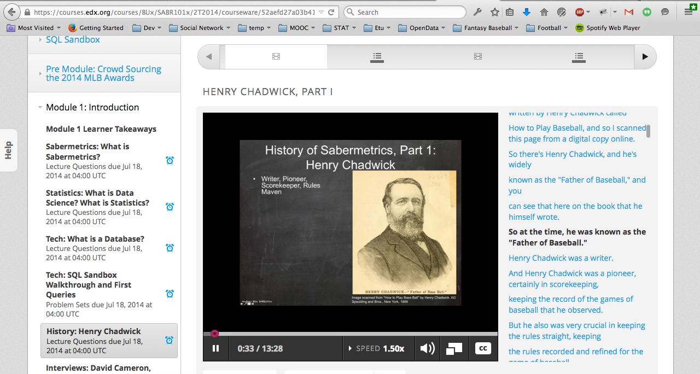

 

# NYC Data Science Academy - Winter 2015

## CORP-R 002: Taiwan Open data and data science

## 臺北國際 OPEN DATA 培訓


--- 

## 說到運動資料的分析，你會想到的是...


---

## 我也是看到報紙才知道（欸


---

## 我也是看到報紙才知道



---

- MLB
- NBA
- NFL
- World Cup 2014
- <del>CPBL</del>

## 別人在上太空，我們還在殺豬公。

---

## Sabermatrics：賽伯計量學


edX: Boston U Sabermetric 101



---

## 前人寫扣，後人乘涼

- [Lahman Database](http://lahman.r-forge.r-project.org/)

```{r, echo=FALSE}
library(Lahman)
library(dplyr)
totalRS <- Teams %>% select(yearID, R) %>% group_by(yearID) %>% summarise(sum(R)) %>% mutate("RS")
names(totalRS) <- c("yearID", "RUN", "TYPE")
totalRA <- Teams %>% select(yearID, RA) %>% group_by(yearID) %>% summarise(sum(RA)) %>% mutate("RA")
names(totalRA) <- c("yearID", "RUN", "TYPE")
yearsSC <- rbind(totalRS, totalRA)
library(ggplot2)
qplot(x = yearsSC$yearID, y = yearsSC$RUN, color = factor(yearsSC$TYPE))
#fig <- ggplot(data = yearsSC, aes(x = yearID, y = RUN, color = factor(TYPE))) + geom_line()
```

--- 

## 前人寫扣，後人乘涼

- [Lahman Database](http://lahman.r-forge.r-project.org/)

```{r}
library(Lahman)
library(dplyr)
head(filter(Batting, playerID == "jeterde01"))
```

---

## 前人寫扣，後人繼續乘涼

- [pitchRx](http://cpsievert.github.io/pitchRx/)
- [openWAR](https://baseballwithr.wordpress.com/2014/03/17/introduction-to-openwar/)

```{r}
library(pitchRx)
# 即時抓取MLB Game Day資料
# 

library(OpenWAR)
# Open Project for WAR (Win Above Replacement)

```

---

## 前人寫扣，後人不能一直乘涼

自己的國家自己救

自己的 crawler/analyzer 自己寫！

---

## 巧婦難為無米之炊：資料哪裡來？


---


## 第一次用Ｒ寫爬蟲就上手

- [RSelenium](http://ropensci.github.io/RSelenium/)
- [phantomJS](http://phantomjs.org/)

```{r, eval=FALSE}
## RSelenium + phantomJS
library(XML)
library(RSelenium)

pJS <- phantom()
Sys.sleep(5)
remDr <- remoteDriver(browserName = 'phantomjs')
remDr$open()

url <- 'http://www.cpbl.com.tw/stats_hr.aspx'
remDr$navigate(url)

```

---

## 資料在手，跟我走！

```{r}
load("~//Documents//OpenDataProj//sc_tables.RData")
load("~//Documents//OpenDataProj//hr_tables.RData")

# 賽伯計量學的畢達哥拉斯定理
win_pc <- function(RS, RA) {
  perc <- RS^2 / (RS^2 + RA^2) 
  return(perc)
}
```

---

## 用Ｒ畫圖跟你想的不一樣

```{r}
library(ggplot2)
```

---

## （並沒有）令十三億人都震驚的事實


---

## 想要玩更多分析嗎？來吧，我把資料都放在這裡了，讓我們一起迎接大數據時代！！！


---

## 可是瑞凡，我回不去了

還想做更多

---

## 賦歸（國道風光）
