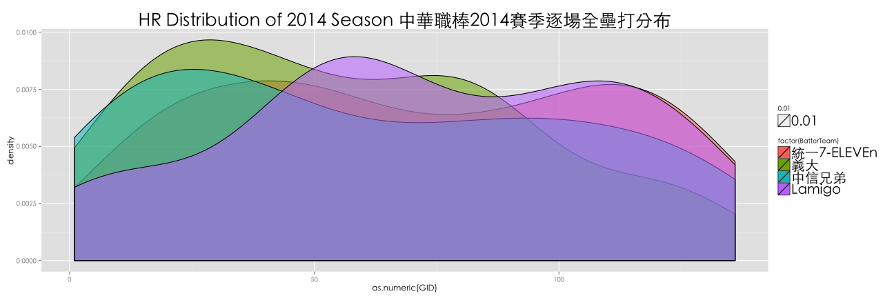

 

# NYC Data Science Academy - Winter 2015

## CORP-R 002: Taiwan Open data and data science

## 臺北國際 OPEN DATA 培訓

---
<!-- Limit image width and height -->
<style type='text/css'>
img {
    max-height: 560px;
    max-width: 964px;
}
</style>

## 說到運動資料的分析，你會想到...


--- 

## 我也是看報紙才知道（誤


---

## 我也是看報紙才知道（誤


---

## Sabermatrics：賽伯計量學


---

## 前人寫扣，後人乘涼

- [Lahman Database](http://lahman.r-forge.r-project.org/)


```r
library(Lahman)
library(dplyr)
totalRS <- Teams %>% select(yearID, R, G) %>% mutate(AvgRperG = R/G) %>% group_by(yearID) %>% summarise(sum(AvgRperG))
names(totalRS) <- c("yearID", "RUN")
head(totalRS)
```

```
## Source: local data frame [6 x 2]
## 
##   yearID      RUN
## 1   1871 93.12897
## 2   1872 95.21474
## 3   1873 73.15998
## 4   1874 58.55903
## 5   1875 70.08774
## 6   1876 47.01267
```

---

## 前人寫扣，後人乘涼

- [Lahman Database](http://lahman.r-forge.r-project.org/)


```r
library(ggplot2)
ggplot(data = totalRS, aes(x = yearID, y = RUN)) + stat_smooth() + geom_line()
```

```
## geom_smooth: method="auto" and size of largest group is <1000, so using loess. Use 'method = x' to change the smoothing method.
```

 

--- 

## 前人寫扣，後人乘涼

- [Lahman Database](http://lahman.r-forge.r-project.org/)


```r
library(Lahman)
library(dplyr)
head(filter(Batting, playerID == "jeterde01"))
```

```
##    playerID yearID stint teamID lgID   G G_batting  AB   R   H X2B X3B HR
## 1 jeterde01   1995     1    NYA   AL  15        15  48   5  12   4   1  0
## 2 jeterde01   1996     1    NYA   AL 157       157 582 104 183  25   6 10
## 3 jeterde01   1997     1    NYA   AL 159       159 654 116 190  31   7 10
## 4 jeterde01   1998     1    NYA   AL 149       149 626 127 203  25   8 19
## 5 jeterde01   1999     1    NYA   AL 158       158 627 134 219  37   9 24
## 6 jeterde01   2000     1    NYA   AL 148       148 593 119 201  31   4 15
##   RBI SB CS BB  SO IBB HBP SH SF GIDP G_old
## 1   7  0  0  3  11   0   0  0  0    0    15
## 2  78 14  7 48 102   1   9  6  9   13   157
## 3  70 23 12 74 125   0  10  8  2   14   159
## 4  84 30  6 57 119   1   5  3  3   13   149
## 5 102 19  8 91 116   5  12  3  6   12   158
## 6  73 22  4 68  99   4  12  3  3   14   148
```

---

## 前人寫扣，後人繼續乘涼

- [pitchRx](http://cpsievert.github.io/pitchRx/#2D_animation)


```r
install.packages("pitchRx")
library(pitchRx)
```


---

## 前人寫扣，後人繼續乘涼

- [openWAR](https://baseballwithr.wordpress.com/2014/03/17/introduction-to-openwar/)


```r
install.packages("Sxslt", repos = "http://www.omegahat.org/R", type = "source")
require(devtools)
install_github("openWAR", "beanumber")
```


--- {bg: red}

## 前人寫扣，後人不能一直乘涼！

<br><del>自己的國家自己救</del></br>

<br>自己的 crawler/analyzer 自己寫！</br>

---

## 巧婦難為無米之炊：資料哪裡來？


---

## 第一次用Ｒ寫爬蟲就上手

- [RSelenium](http://ropensci.github.io/RSelenium/)
- [phantomJS](http://phantomjs.org/)


```r
## RSelenium + phantomJS
library(XML)
library(RSelenium)

pJS <- phantom()
Sys.sleep(5)
remDr <- remoteDriver(browserName = 'phantomjs')
remDr$open()

url <- 'http://www.cpbl.com.tw/stats_hr.aspx'
remDr$navigate(url)

hr_tables <- list()
```

---

## 第一次用Ｒ寫爬蟲就上手

- [RSelenium](http://ropensci.github.io/RSelenium/)
- [phantomJS](http://phantomjs.org/)


```r
year <- seq(1990, 2014)
for (i in 1:length(year)) {
  option <- remDr$findElement(using = 'xpath', paste0("//*/option[@value = '",year[i],"']"))
  option$clickElement()
  src <- option$getPageSource()
  hr_tables[i] <- readHTMLTable(src[[1]], stringAsFactors = FALSE, encoding = "utf8")
}

# View(hr_tables)

remDr$close()
pJS$stop()
```

---

## 資料在手，跟我走！


```r
load("hr_tables.RData")

head(hr_tables[[25]])
```

```
##   NUMBER YEAR      GID      DATE STADIUM   BATTER  BATTERTEAM  PITCHER
## 1      # YEAR GAME NO.      DATE STADIUM   PLAYER PLAYER TEAM  PITCHER
## 2      1 2014        2 2014/3/23    天母 林 威 助    中信兄弟 費 古 洛
## 3      2 2014        3 2014/3/23  澄清湖 詹 智 堯      Lamigo 林 正 豐
## 4      3 2014        4 2014/3/25    新莊 張 志 豪    中信兄弟 林 晨 樺
## 5      4 2014        5 2014/3/26  嘉義市 林 泓 育      Lamigo 林 岳 平
## 6      5 2014        6 2014/3/27    新莊 張 志 豪    中信兄弟 黃 勝 雄
##    PITCHERTEAM RBI REMARK
## 1 PITCHER TEAM RBI REMARK
## 2 統一7-ELEVEn   1       
## 3         義大   1       
## 4         義大   1       
## 5 統一7-ELEVEn   1       
## 6         義大   1
```

---

## 用Ｒ畫圖跟你想的不一樣


```r
par(family = 'Heiti TC Light')
m <- ggplot(hr_table, aes(x = as.numeric(GID)))
m + geom_density(aes(fill = factor(BatterTeam), alpha = 0.01)) + 
    labs(title = paste0("HR Distribution of ", year[i]," Season 中華職棒", year[i], "賽季逐場全壘打分布")) + 
    theme(text = element_text(family="Heiti TC Light"), plot.title = element_text(size = 26), legend.text = element_text(size = 20))
```

 

---

## 資料在手，繼續走！


```r
load("sc_tables.RData")

# 賽伯計量學的畢達哥拉斯定理
win_pc <- function(RS, RA) {
  perc <- RS^2 / (RS^2 + RA^2) 
  return(perc)
}
```


---

## 用Ｒ畫圖跟你想的不一樣趴兔


```r
levels(win_prob$team)
```

```
## [1] "統一7-ELEVEn" "義大"         "中信兄弟"     "Lamigo"
```

```r
# fig <- ggplot(data = win_prob, aes(x = team, y = real, fill = factor(half)))
# fig + geom_bar(stat = "identity", position="dodge")
ggplot(data = win_prob, aes(x = expd, y = real, color = factor(team))) + stat_smooth() + geom_point() + coord_fixed()
```

```
## geom_smooth: method="auto" and size of largest group is <1000, so using loess. Use 'method = x' to change the smoothing method.
```

 

---

## （並沒有）令十三億人都震驚的事實

 [example](http://www.fangraphs.com/community/2014s-most-underpaid-and-overpaid-hitters/)

---

## 想要玩更多分析嗎？來吧，我把資料都放在這裡了，讓我們一起迎接大數據時代！！！


---

## 廣告

謝謝大家 :))


